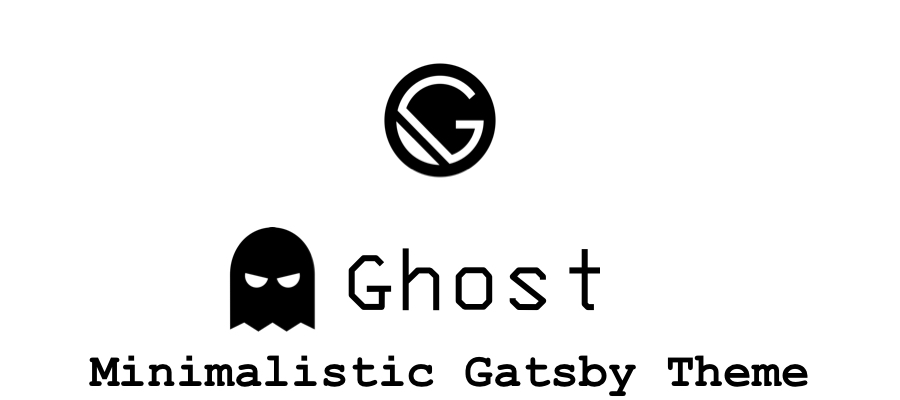
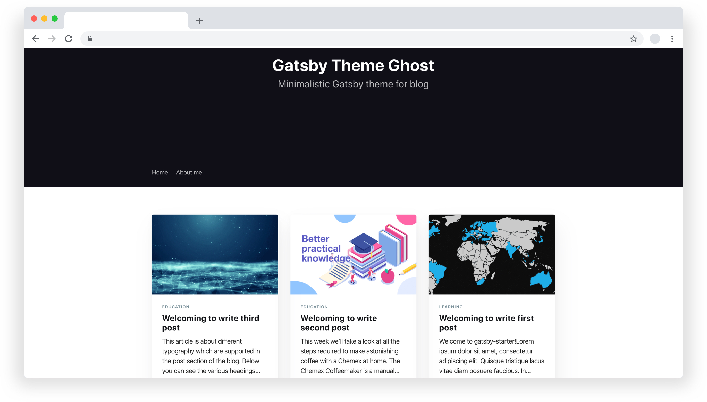

<p align="center">
    
</p>
<p align="center">
  <a href="https://github.com/akanshgulati/gatsby-theme-ghost/blob/master/LICENSE">
    
  </a>
  <a href="https://www.npmjs.org/package/gatsby-theme-ghost">
    
  </a>
  
  <a href="https://twitter.com/intent/follow?screen_name=akanshgulati">
    
  </a>
  <a href="https://app.netlify.com/sites/gatsby-theme-ghost/deploys">
      
    </a>
</p>
<hr/>
<p align="center">
Minimalistic Gatsby theme, mobile and SEO friendly and supports author, tag and static pages
</p>
<p align="center">
    
</p>
<a href="https://gatsby-theme-ghost.netlify.com/" target="_blank">

</a>


## 📦 Installation 

#### Gatsby

```shell script
gatsby new gatsby-blog akanshgulati/gatsby-theme-ghost
```

<small>
This will generate a new site (with the folder name "gatsby-blog") that pre-configures use of the theme including example content.
</small>

<br>


## 💥 Features  
 
- **Code Snippet Support** - Integration with [remark-prismjs](https://www.gatsbyjs.org/packages/gatsby-remark-prismjs/) for beautifying code snippets on posts  
- **100% performance optimisation** -  It has **98+** for both mobile and desktop as per Google lighthouse benchmarks  
   - **Responsive** lazy loading of images for desktop and mobile  
   - **Preloading** of important resource to improve **Critical Rendering Path** of page load  
   - Retina-rich images for **iOS devices** to prevent any blur images.   
   - **Async** loading of non-essential scripts like Google Analytics, etc.  
- **RSS Generator** - Creates RSS for posts to be easily accessible by any RSS reader  
- **SEO Friendly** - SEO score of the posts and entire website is **98+**  
  - **Sitemap** - Generates sitemap for the posts, author page, tag page and static pages.  
   - **Structured data** - Contains [JSON-LD](https://developers.google.com/search/docs/guides/intro-structured-data) format information about the content  
   - **Alt info** - All the images itself has alt attribute as per title of the image.  
   - **Title info** - Links has title attributes for better understanding of link  
- **Social Ready** - All essential `meta-tags` added for sharing posts and website over Facebook, Twitter, Instagram, etc. websites  
- **Analytics** - Integration of Google Analytics for analyses purposes.  
- **Mobile Friendly** - Posts and rest of the pages are mobile friendly to be easily readable.  
- **Accessibility** - Scores **98+** for the posts and home page.  
- **Deploy Ready** - Contains configuration `netlify.toml` for deploying on Netlify directly.  
- **Customisations** - Easy to customise home page, posts and other elements of website.  
- **Comment System** - Integration of the [Disqus](https://github.com/disqus/disqus-react) commenting system  
     
<br/>

## 👨‍💻 Development

```shell script
yarn dev
```
- Runs local website with hot reloading by default at `8000` port
- Runs GraphQL for debugging at `localhost:8000/__graphql` path

<br/>

## ⚙️ Configuration 

Change the website configuration at `utils/siteConfig.js` file.  
   1. Add `Disqus` [short name](https://help.disqus.com/en/articles/1717111-what-s-a-shortname) for enabling comments on posts  
   2. Update the `navigation` links shown in header of website  
   3. Update username of the Twitter and Facebook for icons shown in header of website  


```JS
module.exports = {  
  siteUrl: `https://gatsby-theme-ghost.netlify.com`, // Site domain. Do not include a trailing slash!  
  
  postsPerPage: 12, // Number of posts shown on paginated pages (changes this requires sometimes to delete the cache)  
  
  siteTitleMeta: `Gatsby Theme Ghost`, // This allows an alternative site title for meta data for pages.  
  siteDescriptionMeta: `Minimalistic Gatsby theme for blogs`, // This allows an alternative site description for meta data for pages.  
  siteTwitterHandle: `@akanshgulati`,  
  siteFacebookHandle: `akanshgulati`,  
  language: `en`
  // ...
```

<br/>

## 📝 Adding Content

### New Post  
1. Create a directory for every post under `src/posts` directory, having a markdown file (.md extension)   
2. Add following meta information:  
   - `title`<sup>*</sup>: The title of the post  
   - `date`<sup>*</sup>: The creation date of the markdown file  
   - `slug`<sup>*</sup>: Url of the post  
   - `draft`<sup>*</sup>: Accepts `true/false` as value for visibility of the post  
   - `tags`<sup>*</sup>: Add `tag_id` of different tags in `yaml` format  
   - `author`<sup>*</sup>: Add `author_id` of author  
   - `comment`<sup>*</sup>: To show comment on the page bottom  
   - `feature_image`<sup>*</sup>: The URL of the image shown at the top of the article  
   - `created_at`<sup>*</sup>: Date of the creation of the post (same as date above)  
   - `published_at`<sup>*</sup>: The date of the publishing of the post  
   - `updated_at`<sup>*</sup>: The date of the updating of the post  
   - 3. Add all images and other media content in the same directory as markdown file.  
  
**Note:** Create all tags and authors markdown files before adding it in post.  
  
### New Tag  
1. Create a markdown file by the new tag name under `src/tags` directory.   
2. Add following meta information:  
   - `tag_id`<sup>*</sup>: The id which is mapped with post's tags  
   - `name`<sup>*</sup>: Name as shown on posts if added  
   - `slug`<sup>*</sup>: Url of the tag page  
   - `description`: Description shown on the tag pages before the list of posts  
  
### New Author  
1. Create a markdown file by the new tag name under `src/authors` directory.   
2. Add following meta information:  
   - `author_id`<sup>*</sup>: The id which is mapped with post's author name  
   - `name`<sup>*</sup>: Name as shown on posts if added  
   - `slug`<sup>*</sup>: Url of the author page  
   - `profile_image`<sup>*</sup>: Url of the author image for each post on home page and author page.  
   - `description`: Description shown on the author pages before the list of posts  
   - `twitter`: Username of the Twitter for author page  
   - `facebook`: Username of the Facebook for author page  
   - `website`: URL of the personal website of the author  
  
### New Page  
1. Create a markdown file by the new tag name under `src/pages` directory.   
2. Add following meta information:   
   - `title`<sup>*</sup>: The title shown at the top of the page  
   - `date`<sup>*</sup>: Date of creation of the page  
   - `draft`<sup>*</sup>: Decides if the page is to be shown to public, can have true/false value  
   - `slug`<sup>*</sup>: URL of the page  
   - `created_at`<sup>*</sup>: Date of the creation of the page (same as date above)  
   - `published_at`<sup>*</sup>: The date of the publishing of the page  
   - `updated_at`<sup>*</sup>: The date of the updating of the page  
3. Add body content of the page after the meta information  
  
  
  
**<sup>*</sup>Required**  
  
  
<br/>

  
## 🔭 Directory Structure 

```
.    
├── plugins    
│   └── gatsby-plugin-ghost-manifest    
├── public    
├── src  
│   ├── authors  
│   │   ├── akansh.md  
│   ├── pages    
│   │   └── about    
│   ├── posts    
│   │   ├── best-practises-to-select-cdn  
│   │   ├── ...    
│   │   └── ...   
│   ├── tags  
│   │   ├── javascript.md  
│   ├── components    
│   │   └── common    
│   │       └── meta  
│   ├── styles   
│   ├── templates    
│   └── utils    
│       └── rss    
└── static    
    
```    
- **plugins**: Contains custom plugins created for Gatsby    
- **public**: Contains build files accessible over web    
- **src**: Contains React components as well as content of blog as followed  
   - **authors**: Has markdown files for each author specifying social links, image, name, etc.  
   - **pages**: Has directory for each static page in markdown format  
   - **posts**: Has directory for each blog post having images and markdown format post content  
   - **tags**: Has file for each tag having description, slug, featured image, etc. information  
   - **components**: Has React components for different sections of the website  
   - **styles**: Has CSS(stylesheet) file for the blog  
   - **templates**: Has template in React for post, static page, author page and tag page.  
   - **utils**: Has RSS generator script and **site configuration**.  
- **static**: All the content is copied directly in the public folder on build, stores website favicon, robots.txt file and other files required at root of publicly accessible directory.

<br>

## ☑️ Todo

 - [ ] Previous and Next post widget
 - [ ] Add subscription widget
 - [ ] Netlify CMS integration

## 💪 Maintainer
[Akansh Gulati](https://akansh.com)
